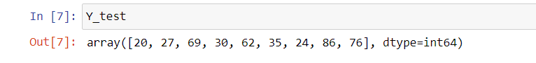
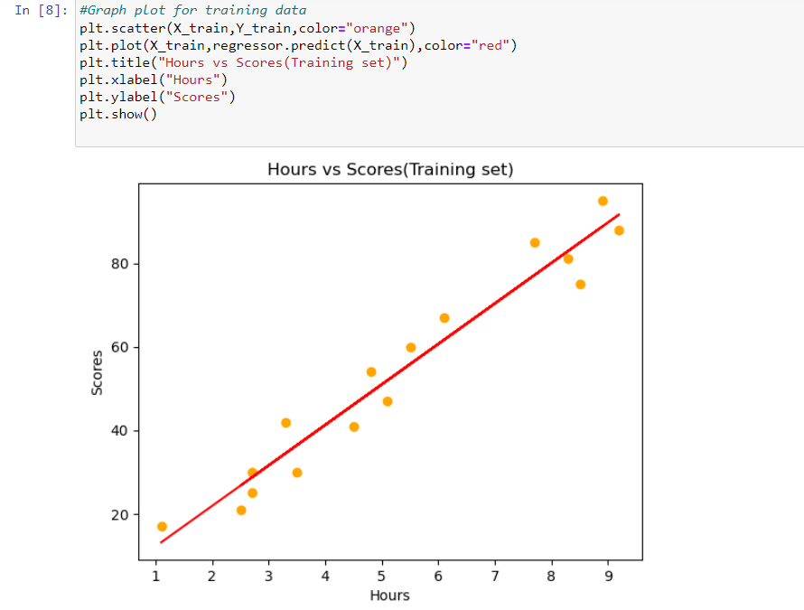
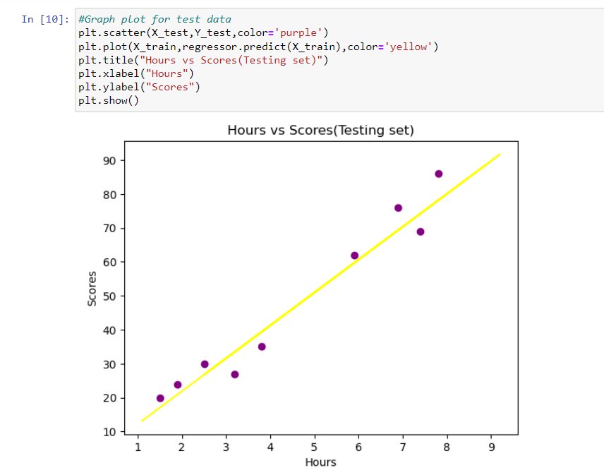
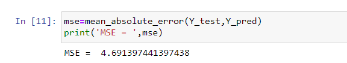
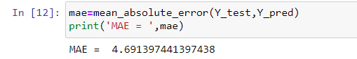
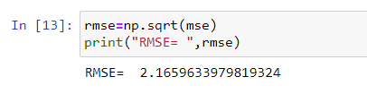

# Implementation-of-Simple-Linear-Regression-Model-for-Predicting-the-Marks-Scored

## AIM:
To write a program to predict the marks scored by a student using the simple linear regression model.

## Equipments Required:
1. Hardware – PCs
2. Anaconda – Python 3.7 Installation / Jupyter notebook

## Algorithm
1. Import the required libaries and read the dataframe.
2. Assign hours to X and scores to Y.
3. Implement training set and test set of the dataframe.
4. Plot the required graph both for test data and training data.
5. Find the values of MSE,MAE and RMSE.

## Program:
```
/*
Program to implement the simple linear regression model for predicting the marks scored.
Developed by: N.Navya Sree
RegisterNumber: 212223040138 
*/
i)
import pandas as pd
import numpy as np
import matplotlib.pyplot as plt
from sklearn.metrics import mean_absolute_error,mean_squared_error
df=pd.read_csv("C:/Users/admin/Downloads/student_scores.csv")
df.head()
ii)
df.tail()
iii)
X=df.iloc[:,:-1].values
X
iv)
y=df.iloc[:,1].values
y
v)
from sklearn.model_selection import train_test_split
X_train,X_test,Y_train,Y_test=train_test_split(X,y,test_size=1/3,random_state=0)
from sklearn.linear_model import LinearRegression
regressor=LinearRegression()
regressor.fit(X_train,Y_train)
Y_pred=regressor.predict(X_test)
Y_pred

vi)
Y_test
vii)
#Graph plot for training data
plt.scatter(X_train,Y_train,color="orange")
plt.plot(X_train,regressor.predict(X_train),color="red")
plt.title("Hours vs Scores(Training set)")
plt.xlabel("Hours")
plt.ylabel("Scores")
plt.show()
viii)
#Graph plot for test data
plt.scatter(X_test,Y_test,color='purple')
plt.plot(X_train,regressor.predict(X_train),color='yellow')
plt.title("Hours vs Scores(Testing set)")
plt.xlabel("Hours")
plt.ylabel("Scores")
plt.show()
ix)
mse=mean_absolute_error(Y_test,Y_pred)
print('MSE = ',mse)
x)
mae=mean_absolute_error(Y_test,Y_pred)
print('MAE = ',mae)
xi)
rmse=np.sqrt(mse)
print("RMSE= ",rmse)

```

## Output:

i).png>)
ii).png>)
iii).png>)
iv).png>)
v).png>)
vi)
vii)
viii)
ix)

x)

xi)

## Result:
Thus the program to implement the simple linear regression model for predicting the marks scored is written and verified using python programming.
